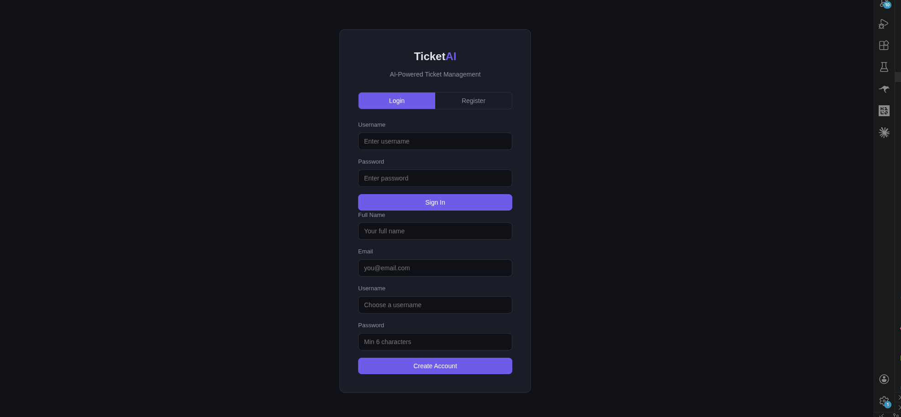
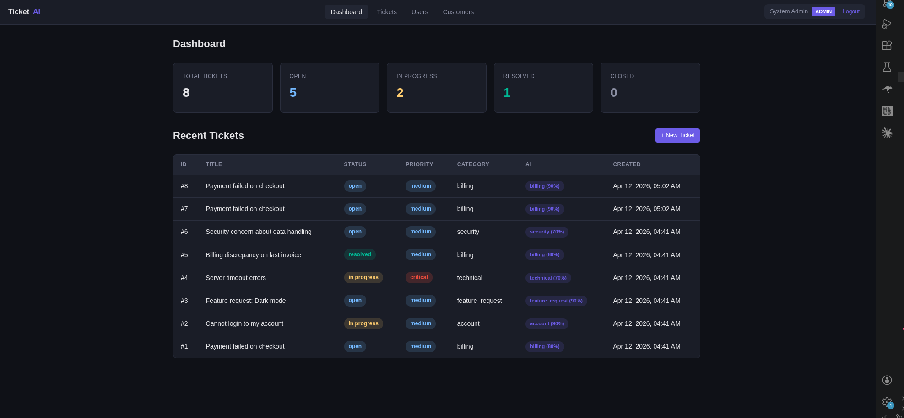
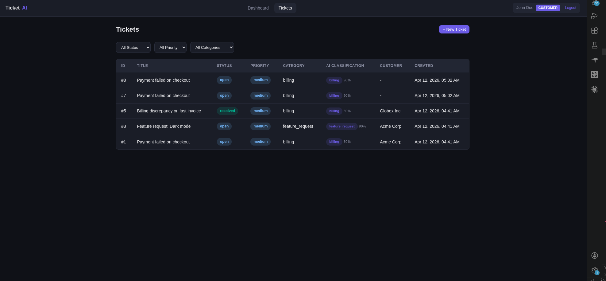
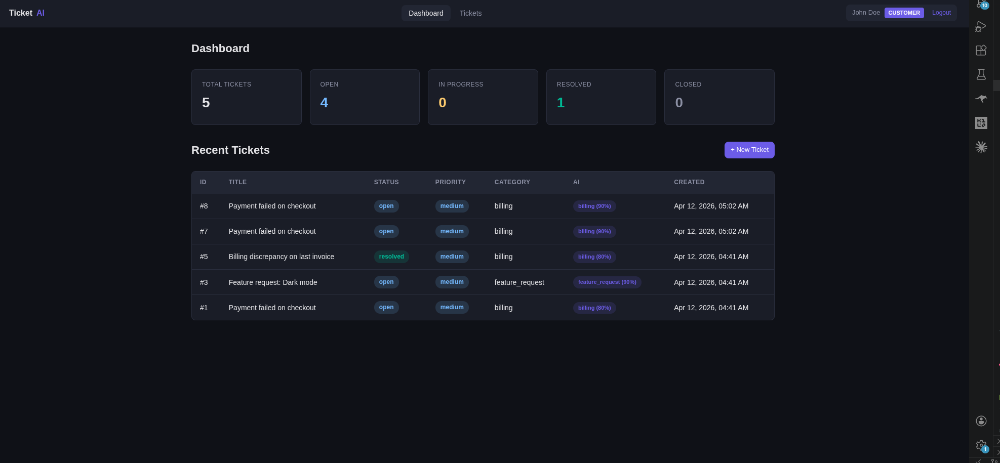
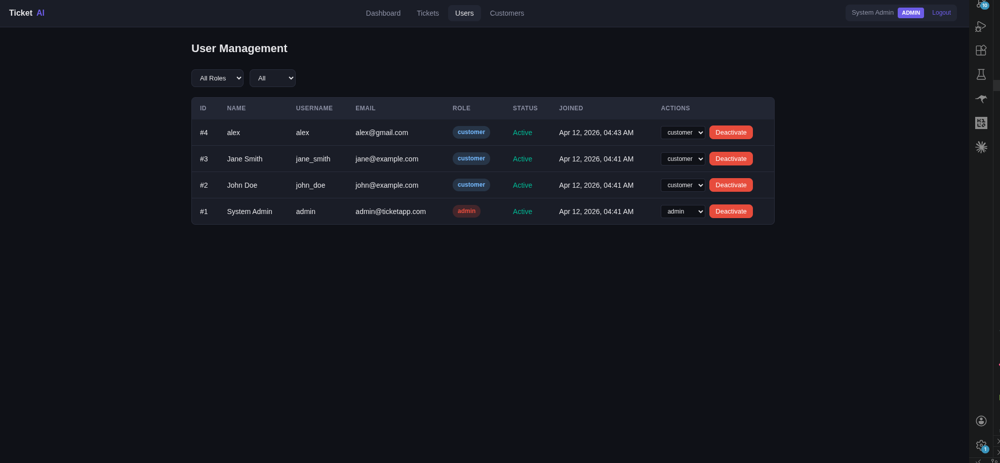

# TicketAI - AI-Powered Customer Ticket Management System

A full-stack ticket management system built with **FastAPI** and **vanilla HTML/CSS/JS** that uses **Google Gemini AI** to automatically classify customer support tickets by category, priority, and provide an initial analysis.

---

## Why This Project?

This project was built to simulate a real-world support system where:

- AI reduces manual triaging effort
- Admins can prioritize issues faster
- Customers get structured responses

It demonstrates backend architecture, async programming, and AI integration.

---


## Screenshots

### Login / Register Page


---

### Admin Pages

| Admin Dashboard | User Management |
|----------------|----------------|
|  |  |

---

### Customer Pages

| Customer Dashboard | Customer Tickets |
|-------------------|------------------|
|  |  |

---


## Features

- Role-based access control (Admin / Customer)
- AI-powered ticket classification using Google Gemini API
- Real-time ticket lifecycle management (create, assign, update, resolve, close)
- Admin dashboard with ticket statistics
- Customer self-service portal
- Internal comments (visible only to admins)
- Dark-themed responsive UI with role-based navigation

---


## Tech Stack

| Layer | Technology |
|-------|-----------|
| **Backend** | Python 3.12+, FastAPI, SQLAlchemy (async), Pydantic v2 |
| **Database** | SQLite via aiosqlite (async) |
| **Auth** | JWT (python-jose), bcrypt password hashing |
| **AI** | Google Gemini 2.5 Flash Lite API |
| **Frontend** | Vanilla HTML, CSS, JavaScript (no framework) |
| **Server** | Uvicorn (ASGI) |

---


## Architecture

Frontend (HTML/JS)
        ↓
FastAPI Backend (API + Auth + Business Logic)
        ↓
SQLite Database (async SQLAlchemy)
        ↓
Gemini AI (ticket classification)

---


## Project Structure

```
ticket/
├── app/
│   ├── __init__.py              # App config, API keys, model settings
│   ├── main.py                  # FastAPI app entry point
│   ├── seed.py                  # Database seeder with sample data
│   ├── api/
│   │   ├── auth.py              # Register, login, /me endpoints
│   │   ├── tickets.py           # Ticket CRUD, comments, stats
│   │   └── admin.py             # Dashboard stats, user/customer management
│   ├── core/
│   │   ├── database.py          # Async SQLAlchemy engine & sessions
│   │   ├── security.py          # bcrypt hashing, JWT encode/decode
│   │   └── deps.py              # Auth dependencies (get_current_user, require_admin)
│   ├── models/
│   │   └── models.py            # SQLAlchemy models (User, Customer, Ticket, Comment)
│   ├── schemas/
│   │   └── schemas.py           # Pydantic v2 request/response schemas
│   └── services/
│       └── ai_classifier.py     # Gemini API integration + keyword fallback
├── static/
│   ├── index.html               # Login / Register page
│   ├── dashboard.html           # Stats cards + recent tickets
│   ├── tickets.html             # Filterable ticket list with create modal
│   ├── ticket-detail.html       # Full ticket view, AI box, comments
│   ├── users.html               # Admin user management
│   ├── customers.html           # Admin customer management
│   ├── style.css                # Dark theme stylesheet
│   ├── app.js                   # Shared API client, auth helpers, toast notifications
│   └── nav.js                   # Role-based dynamic navigation
├── requirements.txt
├── README.md
└── screenshots/
    ├── login.png
    ├── customer-dashboard.png
    ├── customer-tickets.png
    ├── admin-dashboard.png
    └── admin-users.png
```

---


## Getting Started

### Prerequisites

- Python 3.12+
- pip

### Installation

```bash
# Clone the repository
git clone https://github.com/yourusername/ticket-ai.git
cd ticket-ai

# Create virtual environment
python -m venv venv
source venv/bin/activate  # Linux/Mac
# venv\Scripts\activate   # Windows

# Install dependencies
pip install -r requirements.txt
```

### Configure AI API

The Google Gemini API key is pre-configured in `app/__init__.py`. You can override it via environment variable:

```bash
export AI_API_KEY="your-gemini-api-key"
export AI_MODEL="gemini-2.5-flash-lite"
```

To disable AI classification entirely:

```bash
export AI_CLASSIFICATION_ENABLED="false"
```

### Seed the Database & Run

```bash
# Seed with sample data (creates default users, customers, and tickets)
python -m app.seed

# Start the server
uvicorn app.main:app --reload
```

Open `http://127.0.0.1:8000` in your browser.

---

## Testing Credentials

Use these accounts to explore the system:

| Role | Username | Password |
|------|----------|----------|
| **Admin** | `admin` | `admin123` |
| **Customer** | `john_doe` | `customer123` |
| **Customer** | `jane_smith` | `customer123` |

> **Admin** can view all tickets, manage users/customers, and update any ticket. **Customers** can only see and manage their own tickets.

---


## How It Works

### Ticket Lifecycle

1. **Customer** logs in and creates a ticket describing their issue
2. **Gemini AI** instantly classifies the ticket — assigning a category, priority, and writing a brief analysis
3. **Admin** sees all tickets on their dashboard, reviews the AI classification, and takes action
4. Admin updates status, adds comments (internal or public), and resolves the ticket
5. **Customer** tracks their ticket status and communicates through comments

### Where AI Is Used

AI classification happens at **ticket creation time** in `app/services/ai_classifier.py`:

```
Customer submits ticket
        ↓
POST /api/tickets
        ↓
classify_ticket(title, description) is called
        ↓
    ┌──────────────────────────┐
    │  Gemini API (primary)    │ → Sends title + description to gemini-2.5-flash-lite
    │  Returns: category,      │   with a structured prompt requesting JSON output
    │  priority, confidence,   │
    │  analysis                │
    └──────────┬───────────────┘
               ↓ (on API failure/quota exceeded)
    ┌──────────────────────────┐
    │  Keyword fallback        │ → Regex-based matching against predefined
    │  Returns: category,      │   keyword rules for each category and priority
    │  priority, confidence,   │
    │  analysis                │
    └──────────────────────────┘
```

The AI result is stored on the ticket as `ai_category`, `ai_confidence`, and `ai_analysis`, and is visible in the ticket detail view.


## AI Design Decisions

- Used Gemini 2.5 Flash Lite for low latency + cost efficiency
- Implemented fallback classification to ensure system reliability
- AI is isolated in service layer → easily replaceable
---


## Errors Faced & Solutions

### 1. `passlib` incompatible with `bcrypt>=5.0`

**Error:** `passlib` hadn't been updated to support `bcrypt` 5.x, causing import crashes.

**Fix:** Removed `passlib` entirely and used `bcrypt` directly for password hashing and verification:

```python
import bcrypt

def hash_password(password: str) -> str:
    return bcrypt.hashpw(password.encode(), bcrypt.gensalt()).decode()

def verify_password(plain: str, hashed: str) -> bool:
    return bcrypt.checkpw(plain.encode(), hashed.encode())
```

---

### 2. SQLAlchemy `MissingGreenlet` error on ticket listing

**Error:** Lazy-loading relationships (`ticket.creator.full_name`) in an async context raised `MissingGreenlet` because SQLAlchemy async sessions don't support synchronous lazy loads.

**Fix:** Added eager loading with `selectinload` for all relationship fields:

```python
EAGER_LOAD_OPTIONS = [
    selectinload(Ticket.creator),
    selectinload(Ticket.assignee),
    selectinload(Ticket.customer),
    selectinload(Ticket.comments),
]
```

Every ticket query now uses `.options(*EAGER_LOAD_OPTIONS)` to load relationships in a single round trip.

---

### 3. Static files returning 404

**Error:** `StaticFiles(directory="static")` used a relative path that didn't resolve correctly depending on the working directory.

**Fix:** Computed an absolute path from the application entry point:

```python
BASE_DIR = Path(__file__).resolve().parent.parent
STATIC_DIR = BASE_DIR / "static"
app.mount("/static", StaticFiles(directory=str(STATIC_DIR)), name="static")
```


---

### 4. JavaScript `event.target` undefined in onclick handler

**Error:** The login tab switching function used `event.target` without receiving `event` as a parameter. In some browser contexts, the implicit global `event` object is undefined.

**Fix:** Passed the clicked element directly via `this`:

```html
<button onclick="showTab('login', this)">Login</button>
```

```javascript
function showTab(tab, btn) {
    document.querySelectorAll(".auth-tabs button").forEach(b => b.classList.remove("active"));
    btn.classList.add("active");
    // ...
}
```

---

### 5. Missing `email-validator` and `greenlet` dependencies

**Error:** Pydantic's `EmailStr` requires `email-validator`, and SQLAlchemy async requires `greenlet`. Both were missing from `requirements.txt`.

**Fix:** Added `email-validator==2.3.0` and `greenlet==3.4.0` to dependencies.

---

## API Endpoints

### Authentication

| Method | Endpoint | Access | Description |
|--------|----------|--------|-------------|
| POST | `/api/auth/register` | Public | Register new user (customer role) |
| POST | `/api/auth/login` | Public | Login, returns JWT |
| GET | `/api/auth/me` | Authenticated | Get current user profile |
| PUT | `/api/auth/me` | Authenticated | Update profile |

### Tickets

| Method | Endpoint | Access | Description |
|--------|----------|--------|-------------|
| POST | `/api/tickets` | Any user | Create ticket (AI classifies automatically) |
| GET | `/api/tickets` | Any user | List tickets (customers see only their own) |
| GET | `/api/tickets/stats` | Any user | Ticket statistics |
| GET | `/api/tickets/{id}` | Any user | Get ticket detail |
| PATCH | `/api/tickets/{id}` | Admin | Update ticket (status, priority, assignee) |
| DELETE | `/api/tickets/{id}` | Admin | Delete ticket |
| POST | `/api/tickets/{id}/comments` | Any user | Add comment |
| GET | `/api/tickets/{id}/comments` | Any user | List comments (internal hidden from customers) |

### Admin

| Method | Endpoint | Access | Description |
|--------|----------|--------|-------------|
| GET | `/api/admin/dashboard` | Admin | Dashboard statistics |
| GET | `/api/admin/users` | Admin | List all users |
| PATCH | `/api/admin/users/{id}` | Admin | Update user role/status |
| DELETE | `/api/admin/users/{id}` | Admin | Deactivate user |
| POST | `/api/admin/customers` | Admin | Create customer |
| GET | `/api/admin/customers` | Admin | List customers |
| PATCH | `/api/admin/customers/{id}` | Admin | Update customer |
| DELETE | `/api/admin/customers/{id}` | Admin | Deactivate customer |
